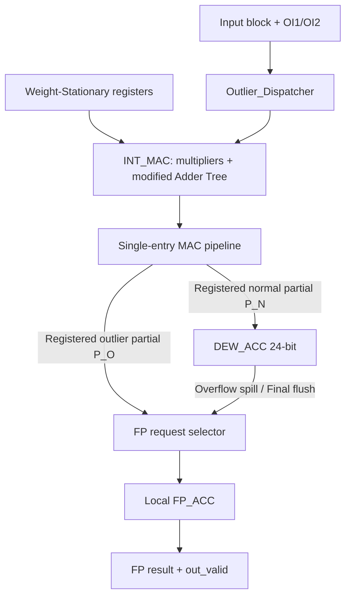

# DEW_PE RTL Design Plan

> 文件狀態: Approved design / implementation reference
> 版本: v1.1
> 適用目錄: `research1/rtl/03_DEW-PE/01_RTL/`
> 本版範圍: **RTL Design only**，不包含 Testbench、Assertion、Simulation、Synthesis 或其他 Verification 規劃。

## 1. 目的

本文件定義 `DEW_PE` 的初版 RTL architecture、module boundary、interface、data format、arithmetic rule 與 cycle-level control。實作會以現有 Baseline `BFP_PE` 為起點，保留其 Weight-Stationary dataflow 與 FP accumulation behavior，並加入以下功能:

1. Top-2 activation outlier index decoding。
2. 依架構圖修改的 routed Adder Tree。
3. 具有 asymmetric exponent window 的 `DEW_ACC`。
4. 24-bit fixed-width accumulation 與 overflow spill。
5. 單一 local `FP_ACC` 的 request scheduling。

本文件已完成設計確認，RTL implementation 依此版本進行。

## 2. 已確認的設計規格

### 2.1 固定的初版 design point

| 項目 | 初版設定 |
|---|---|
| Weight format | W-BFP4，G16，single shared exponent |
| Activation format | T2A-BiE4，G16，normal / outlier 各一個 shared exponent |
| Group size | **16 lanes** |
| Outlier 上限 | **2 lanes / block** |
| `T_SKIP` | **9** |
| `T_REPLACE` | **3** |
| `DEW_ACC_W` | **24 bits，包含 sign bit** |
| FP accumulator | **1 個 local FP32-like `FP_ACC`** |
| FIFO | **不實作** |
| Shared FP-Acc | **不實作跨 PE sharing** |

`DEW (9, 3)` 在本設計中明確表示:

```text
T_SKIP    = 9
T_REPLACE = 3
```

### 2.2 參考來源與優先順序

設計依據的優先順序如下:

1. 本次已確認的使用者規格。
2. [`architecture.pdf`](../../thesis/figures/architecture.pdf) 的 Outlier Dispatcher 與 Adder Tree。
3. `research1/docs/Process.md` 的 DEWA numerical contract。
4. Baseline `BFP_PE / INT_MAC / FP_ACC` RTL。
5. Bucket Getter 的 registered spill control pattern。

架構圖中的 `Shared FP-ACC` 是 system-level 方向；本次依指定改成每個 `DEW_PE` 內只有 **1 個 local FP_ACC**。Adder Tree 與 outlier routing 本身仍遵循架構圖。

## 3. 整體 Architecture



核心資料流為:

1. Weight 先由 `weight_load` 寫入 Weight-Stationary registers。
2. 每個 accepted activation block 依 `oi1/oi2` 重新排列 weight/activation lane pairs，將 OP1/OP2 固定放到 lanes 15/14。
3. 16 個 lane 各做一次 mantissa multiplication；不為 outlier 額外複製 multiplier。
4. `INT_MAC` 內部依架構圖以 DMux、tail Adder、DMux、Mux 形成 `P_N` 與單一 `P_O`。
5. `P_N/P_O` 與各自 exponent 先進 single-entry MAC pipeline，再分別送往 `DEW_ACC` 與 FP request selector。
6. `P_O` 與 DEW spill 經簡單 selector 依序送進單一 `FP_ACC`。

## 4. Top-Level Interface: `DEW_PE`

### 4.1 Interface 定義

| Port | Direction | Width | 語意 |
|---|---|---:|---|
| `clk` | input | 1 | Clock |
| `rst_n` | input | 1 | Active-low asynchronous reset |
| `acc_clear` | input | 1 | 清除目前 accumulation transaction，不清除 weight registers |
| `weight_load` | input | 1 | 載入 packed weight block 與 `w_exp` |
| `in_valid` | input | 1 | Input block valid |
| `in_ready` | output | 1 | PE 可接受 input block |
| `in_last` | input | 1 | 本 block 是目前 dot product 的最後一個 G16 block |
| `w_sign_b` | input | 16 | Packed weight signs |
| `w_man_b` | input | 48 | 16 × 3-bit weight magnitudes |
| `w_exp` | input | 5 | Weight shared exponent |
| `a_sign_b` | input | 16 | Packed activation signs |
| `a_man_b` | input | 48 | 16 × 3-bit activation magnitudes |
| `a_exp` | input | 5 | Normal activation shared exponent |
| `oa_exp` | input | 5 | Outlier activation shared exponent |
| `oi1` | input | 4 | Outlier index slot 1 |
| `oi2` | input | 4 | Outlier index slot 2 / count marker |
| `out_valid` | output | 1 | Final FP result valid |
| `out_ready` | input | 1 | Consumer 接受 final result |
| `o_sign` | output | 1 | FP result sign |
| `o_exp` | output | 8 | FP result exponent |
| `o_man` | output | 23 | FP result mantissa |
| `busy` | output | 1 | Transaction 或未取走 result 尚未結束 |

### 4.2 Handshake contract

Input transfer 只在以下條件成立時發生:

```text
input_fire = in_valid && in_ready
```

`in_valid=1` 但 `in_ready=0` 時，upstream 必須保持所有 input payload 與 `in_last` 不變。`out_valid=1` 但 `out_ready=0` 時，`o_sign/o_exp/o_man` 必須保持不變。

`acc_clear` 與 `in_valid` 必須 mutually exclusive。Clear cycle 不接受 input transaction；`in_ready` 只由 registered datapath/control state 產生，不直接依賴 `acc_clear`，與 Bucket Getter 的 interface contract 一致。

`weight_load` 延續 Baseline semantics: 同 cycle 的 input 使用舊的 registered weight，新 weight 從下一個 cycle 才可見。系統正常使用時應在新 transaction 開始前完成 `weight_load`。

## 5. Outlier Index Encoding 與 Routing Rule

### 5.1 Canonical encoding

```text
0 outlier : {oi1, oi2} = {4'b1111, 4'b1111}
1 outlier : {oi1, oi2} = {OI1,      4'b0000}
2 outlier : {oi1, oi2} = {OI1,      OI2}
```

`Outlier_Dispatcher` 不計算 `outlier_count`，只產生兩個簡單的 routing valid:

```text
no_outlier     = &(oi1 & oi2)  // 等價於 oi1==4'hF 且 oi2==4'hF
outlier1_valid = !no_outlier
outlier2_valid = !no_outlier && (oi2 != 4'h0)
```

也就是先判斷 `oi1` 與 `oi2` 是否同時為全 1；若成立，兩個 index 都不分配。否則 `oi1` 一律有效，而 `oi2=0` 時只忽略第二個 index，不加入其他 count decoder 或特殊狀態。

### 5.2 Encoding 的必要限制

因為 `oi2 = 4'h0` 代表「忽略 OI2」，input encoder 必須遵守:

1. `oi1 != oi2`。
2. two-outlier case 的 `oi2` 不可為 lane 0。
3. 若兩個 outlier 包含 lane 0，lane 0 必須放在 `oi1`。

RTL 不會修正非法 index encoding；`oi2=0` 時單純不配置 Outlier 2。合法 index 會由 Dispatcher 用於 lane-pair permutation。

## 6. Module 分解

### 6.1 `DEW_PE.sv`: Top integration 與 control owner

責任如下:

1. 保存 Weight-Stationary registers。
2. 計算 normal / outlier block exponent。
3. 連接 Dispatcher、INT_MAC、DEW_ACC 與 FP_ACC。
4. 保存 single-entry MAC pipeline payload 與 backpressure。
5. 管理 local FP source selection 並產生 `in_ready/out_valid/busy`。

Exponent 計算沿用 Baseline:

```text
normal_blk_exp  = w_exp_reg + a_exp  - BFP_EXP_BIAS
outlier_blk_exp = w_exp_reg + oa_exp - BFP_EXP_BIAS
```

兩條 exponent path 都使用 signed `BFP_BEXP_W`，避免負 exponent 被 unsigned arithmetic 破壞。

### 6.2 `Outlier_Dispatcher.sv`: Two-stage lane-pair routing

原有 stub 檔名 `Outlier_Dispather.sv` 有拼字錯誤。實作已更名為 `Outlier_Dispatcher.sv`，module name 同步使用 `Outlier_Dispatcher`。

此 module 不負責 exponent、product 或 outlier count 計算。它將每個 lane 的 `{weight sign/mantissa, activation sign/mantissa}` 視為不可拆分的 payload，依 `oi1/oi2` 做兩級 swap，使 multiplier inputs 先完成固定位置排列。

Interface 保持精簡:

| Signal | Direction | 語意 |
|---|---|---|
| Weight/activation packed buses | input | 尚未重新排列的 16 組 lane pairs |
| `oi1`, `oi2` | input | Encoded outlier indices |
| Routed weight/activation buses | output | 已完成 OP1/OP2 tail placement 的 lane pairs |
| `outlier1_valid`, `outlier2_valid` | output | 兩個 routing slot 的有效狀態 |

實際 routing rule 為:

```text
no_outlier = &(oi1 & oi2)
outlier1_valid = !no_outlier
outlier2_valid = !no_outlier && (oi2 != 4'h0)

stage1 = input_lanes
if (outlier1_valid) swap(stage1[oi1], stage1[15])

stage2 = stage1
oi2_position = (oi2 == 15) ? oi1 : oi2
if (outlier2_valid) swap(stage2[oi2_position], stage2[14])
```

因此 0-outlier case 不交換任何 lane；1-outlier case 只保證 `lane[15]=OP1`；2-outlier case 保證 `lane[15]=OP1`、`lane[14]=OP2`。`oi2_position` 修正第一次 swap 可能移動原始 lane 15 的情況。Normal lane 的順序不影響 dot product，但每一組 lane pair 必須恰好保留一次。

Encoded outlier 的 mantissa 即使為 0，lane ownership 仍依 index 決定。Weight 與 activation 必須一起 swap，避免破壞 dot-product pairing；Top 再依 `P_O` magnitude 是否為 0 決定是否產生 FP request。

### 6.3 `INT_MAC.sv`: Multiplier array 與 modified Adder Tree

`INT_MAC` 由 Baseline 延伸，保留 16 個 shared lane multipliers:

```text
prod[i]  = w_man[i] * a_man[i]
sign[i]  = w_sign[i] XOR a_sign[i]
sprod[i] = sign[i] ? -prod[i] : prod[i]
```

Adder Tree 邏輯直接放在 `INT_MAC.sv`，不另外建立 `DEW_ADDER_TREE` module。Dispatcher 已保證 `sprod[15]=OP1`，且 two-outlier case 為 `sprod[14]=OP2`。Tail path 完全依架構圖實作為兩個 DMux、一個 Adder 與一個 Mux:

```text
one_outlier  = outlier1_valid && !outlier2_valid
two_outliers = outlier2_valid

DMux 1:
    op1_to_tail    = one_outlier ? 0   : sprod[15]
    op1_to_outlier = one_outlier ? sprod[15] : 0

Tail Adder:
    tail_sum = sprod[14] + op1_to_tail

DMux 2:
    tail_to_normal  = two_outliers ? 0        : tail_sum
    tail_to_outlier = two_outliers ? tail_sum : 0

Final Mux:
    P_O = one_outlier ? op1_to_outlier : tail_to_outlier
```

`tail_to_normal` 作為 balanced Adder Tree 的第八個 stage-1 input:

```text
stage1[0..6] = pairwise add sprod[0..13]
stage1[7] = tail_to_normal
stage2[0..3] = pairwise add stage1[0..7]
stage3[0..1] = pairwise add stage2[0..3]
P_N = stage3[0] + stage3[1]
```

這個結構對應三種 case:

```text
0 outlier : P_N = sum(sprod[0..13]) + sprod[14] + sprod[15], P_O = 0
1 outlier : P_N = sum(sprod[0..13]) + sprod[14],             P_O = sprod[15]
2 outliers: P_N = sum(sprod[0..13]),                         P_O = sprod[14] + sprod[15]
```

`INT_MAC` 不接收 `oi1/oi2`，也不建立 16:1 product Mux-Tree 或 16-lane normal mask。Stage width 依每層增加 1 bit:

```text
lane product = 7 bits signed
stage 1      = 8 bits signed
stage 2      = 9 bits signed
stage 3      = 10 bits signed
final sum    = 11 bits signed
```

`INT_MAC` 最後輸出兩條 logically independent path:

| Output | Width | 語意 |
|---|---:|---|
| `normal_sign` | 1 | Normal partial sign |
| `normal_mag` | `BFP_MAG_W` | 所有 normal lanes 的 signed sum magnitude |
| `outlier_sign/outlier_mag` | 1 / `BFP_SPROD_W` | Zero-to-two outlier lanes 的 signed partial sum `P_O` |

`INT_MAC` 不做 exponent comparison，也不保存 accumulation state。

所有 add operation 都在 signed domain 進行，最後才將 `P_N/P_O` 轉為 sign-magnitude。`P_O` 最多為兩個 signed products 的和，因此 magnitude 使用 `BFP_SPROD_W=7` bits。

### 6.4 Single-entry MAC Pipeline

`INT_MAC` 後放置一組 elastic pipeline registers，保存 `valid/last`、`P_N`、`P_O`，以及 normal/outlier exponent。此 stage 與 Bucket Getter 的 `mac_*_reg` 使用相同目的，將 `Outlier_Dispatcher + INT_MAC` 與後端 `DEW_ACC/FP_ACC` timing cone 切開。`P_O=0` 直接代表不產生 outlier request，因此不另存 outlier-valid bit。

```text
mac_fire  = mac_valid_reg && dew_in_ready
mac_ready = !mac_valid_reg || dew_in_ready
in_ready  = mac_ready && !closing && !out_valid
```

Pipeline 為空時，即使 DEW spill 正在送入 `FP_ACC`，仍可先接收一筆新 input；若 pipeline 已有資料且 `DEW_ACC` backpressure，則完整 payload 保持不變。這是 datapath pipeline，不是 FIFO 或 FP request pending slot。

### 6.5 `DEW_ACC.sv`: 24-bit Dynamic Exponent-Window Accumulator

`DEW_ACC` 保存以下 state:

| Register | Width | 用途 |
|---|---:|---|
| `acc_valid_reg` | 1 | Accumulator 是否非空 |
| `acc_value_reg` | `DEW_ACC_W=24` signed | Two's-complement integer accumulator |
| `acc_lsb_exp_reg` | `BFP_BEXP_W` signed | `acc_value_reg[0]` 對應的 exponent scale |
| `spill_valid_reg` | 1 | Registered FP request slot，供 overflow 或 final flush 共用 |
| `spill_sign/mag/exp_reg` | parameterized | 共用 spill payload |

`spill_valid_reg` 採 Bucket Getter 相同的一筆 registered spill 形式：產生 overflow 或 final flush 時寫入，直到 Top 以 `spill_ready` 接收後清除。它只是 DEW_ACC 的 output register，不是 FIFO。

`DEW_ACC_W` 包含 sign bit。正常可表示範圍為:

```text
-2^(DEW_ACC_W-1) ... 2^(DEW_ACC_W-1)-1
```

#### 6.5.1 Leading exponent

對非零輸入 normal partial:

```text
E_new = normal_blk_exp + floor(log2(normal_mag))
```

對非零 accumulator:

```text
E_acc = acc_lsb_exp_reg + floor(log2(abs(acc_value_reg)))
delta = E_new - E_acc
```

比較的必須是 **current numeric accumulator** 的 leading exponent。每次 addition 或 cancellation 後，都從更新後的 accumulator magnitude 重新取得 leading exponent；不保存 historical maximum exponent。

#### 6.5.2 Decision rule

```text
P_N == 0                     : HOLD
acc_valid == 0               : LOAD P_N
delta <= -T_SKIP             : SKIP_NEW
delta >= +T_REPLACE          : REPLACE_OLD
-T_SKIP < delta < T_REPLACE  : ALIGN_ADD
```

初版帶入 `(T_SKIP, T_REPLACE) = (9, 3)`:

```text
delta <= -9       : discard New
delta >= +3       : discard Old，accumulator 改為 New
-9 < delta < +3   : align and add
```

`REPLACE_OLD` 是 DEWA approximation policy；被取代的 old accumulator 不會送往 FP_ACC。

#### 6.5.3 Alignment rule

`acc_value_reg` 與 `P_N` 各自帶有 LSB exponent。進入 `ALIGN_ADD` 時:

```text
common_lsb_exp = max(acc_lsb_exp_reg, normal_blk_exp)
```

LSB exponent 較小的 operand 先對 magnitude 做 logical right shift，再恢復 sign，等效於 sign-magnitude truncation toward zero。之後將兩個 aligned signed values sign-extend 到 `DEW_ACC_W+1` 再相加。

這個規則避免對負數直接做 arithmetic right shift 所造成的 round-toward-negative-infinity 偏差，也與現有 Baseline `FP_ACC` 對較小 magnitude 的 truncation 方向一致。

#### 6.5.4 Overflow rule

所有 commit 前的 addition 都使用 `DEW_ACC_W+1` widened candidate:

```text
candidate = aligned_old + aligned_new
overflow  = candidate 超出 24-bit signed range
```

發生 overflow 時:

1. 不 commit wrapped 或 saturated 24-bit value。
2. 保存完整的 **25-bit candidate sign/magnitude** 與 `common_lsb_exp`。
3. 將 candidate 寫入共用 `spill_*_reg`，下一個 cycle assert `spill_valid` 並送入 `FP_ACC`。
4. 將 DEW accumulator 清成 invalid / zero，後續 normal partial 重新由 `LOAD` 開始。

因此一次 overflow request 代表「截至該 block 的完整 DEW integer subtotal」，不是只送 new partial，也不會造成 old value 被重複累加。

#### 6.5.5 Final flush rule

當 accepted block 同時帶有 `in_last=1`:

- 若本次沒有 overflow，將更新後的 nonzero `DEW_ACC` 寫入同一個 `spill_*_reg`。
- 若本次 overflow，overflow candidate 已包含最後一次 normal update，不再另外產生 final request。
- 若 final DEW value 為 0，不產生 FP request，但 normal path 仍回報完成。
- Final spill 被 FP_ACC 接收後，清除 DEW state。

最終結果只從 local `FP_ACC` 輸出，因此不需要額外的 FP adder 去合併 DEW output 與 exception output。

### 6.6 `FP_ACC.sv` 與 `BFP_PKG.sv`: Reuse boundary

下列 Baseline behavior 原封不動保留:

1. `FP_ADD` 的 exponent alignment、sign add/subtract 與 normalization。
2. 單一 `acc_reg` 的 update semantics。
3. `acc_clear` priority。
4. FP output format `1S / 8E / 23M`。
5. 既有的 truncation、underflow-to-zero 與 overflow saturation policy。

`FP_ACC` 的 input interface 與 Baseline、Bucket Getter 對齊，固定接受 `BFP_MAG_W=10` 的 magnitude。Outlier product 直接 zero-extend；`DEW_ACC` 的 24/25-bit final 或 overflow magnitude 則在寫入 registered spill 前保留最高 10 個有效位元:

```text
shift     = max(msb_position - (BFP_MAG_W - 1), 0)
spill_mag = raw_mag >> shift
spill_exp = raw_exp + shift
```

右移造成的低位元捨棄採 truncation toward zero；若 `raw_mag` 本來就能以 10 bits 表示，則 magnitude 與 exponent 均保持不變。`FP_ACC.NORM`、`FP_ADD` 與 accumulator register 直接維持 Baseline 的固定寬度 implementation。

## 7. Local FP Request Selection

### 7.1 Request sources

單一 `FP_ACC` 共有三種 source:

| Source | 產生時機 | Exponent |
|---|---|---|
| `P_O` | accepted block 的 outlier partial sum 非零 | `outlier_blk_exp` |
| `DEW_OVERFLOW` | 24-bit `ALIGN_ADD` overflow | `common_lsb_exp` |
| `DEW_FINAL` | `in_last` 後 normal accumulator 非零 | `acc_lsb_exp` |

Exception path 不做 exponent comparison。每個 accepted block 的 zero-to-two outlier products 先在 INT_MAC 形成單一 `P_O`，與 exponent 一起進 MAC pipeline；pipeline 被消費且 `P_O` 非零時送往 FP_ACC。

### 7.2 不使用 FIFO 的實作方式

本設計不建立 queue、pointer、counter、FP pending slot 或 request array，只保留兩個必要的 one-entry state:

- Top-level `mac_*_reg` 保存一筆尚未被 `DEW_ACC` 消費的完整 MAC payload。
- `DEW_ACC.spill_valid_reg` 與一組 `spill_sign/mag/exp`，overflow 和 final flush 共用。

Top 另外使用 `closing_reg` 記住已接受 `in_last`。MAC pipeline 透過 `mac_ready` 接受 backpressure；DEW spill 存在時不會消費 pipeline payload，因此 outlier 與 spill 不會同 cycle 送入 FP_ACC。

### 7.3 Arbitration priority 與固定順序

FP_ACC 每 cycle 最多接受一筆 request。順序固定為:

```text
1. DEW spill     // overflow 或 final flush 共用
2. Pipeline P_O  // 只會在 mac_fire 時出現
```

若同一個 block 同時包含 `P_O` 並造成 DEW spill，實際 FP order 固定為:

```text
accepted cycle       : capture P_N/P_O into MAC pipeline
MAC processing cycle : P_O
following cycle      : DEW spill
```

Overflow 與 final flush 不建立兩套 arbitration；兩者都走同一個 registered spill port。如此 overflow 一定能在下一個 cycle 送入 FP_ACC，control 也只需固定 priority mux。

### 7.4 Cycle behavior 摘要

| Accepted block event | FP_ACC / stall behavior |
|---|---|
| 0 outlier，no overflow | Accepted cycle 寫入 pipeline；下一 cycle消費且無 FP request |
| 1 outlier，no overflow | Accepted cycle 寫入 pipeline；下一 cycle送 P_O |
| 2 outliers，no overflow | Accepted cycle 寫入 pipeline；下一 cycle送合併後的 P_O |
| Any overflow | MAC processing 後下一 cycle送 widened candidate；pipeline consumption stall |
| `in_last` | 排空 overflow/final request 後才產生 `out_valid` |

Zero-magnitude request 不會觸發 `FP_ACC.in_valid`，但 corresponding control slot 仍會被視為已完成。

## 8. Control 與 Output Lifecycle

Top-level 不建立額外 processing FSM，只使用 single-entry MAC pipeline、`transaction_active_reg`、`closing_reg` 與 `out_valid_reg`；DEW request state 由 `DEW_ACC.spill_valid_reg` 自己保存。`transaction_active_reg` 只負責讓 `busy` 在零值 block 之間仍維持正確的 transaction 語意，不參與 datapath scheduling。

`in_ready` 的基本條件:

```text
mac_ready = !mac_valid_reg || dew_in_ready
in_ready  = mac_ready
         && !closing
         && !out_valid
```

`busy` 在以下任一狀態為 1:

- DEW accumulator 已有有效 subtotal。
- MAC pipeline 尚有有效 payload。
- `dew_spill_valid`。
- 已接受 `in_last` 且 transaction 正在 closing。
- `out_valid` 尚未被 `out_ready` 接收。

當最後一筆必要 FP request 在某個 rising edge 被 `FP_ACC` 接收，更新後的 FP accumulator output 於該 edge 後可見，同時 assert `out_valid`。Result handshake 完成後清除 `out_valid/closing`；下一筆 transaction 必須先由 `acc_clear` 建立乾淨 accumulator state。

## 9. Reset 與 Clear Priority

Sequential control priority 統一為:

```text
if (!rst_n)
    reset all state, including weight registers;
else if (acc_clear)
    clear DEW_ACC, FP_ACC, closing and out_valid;
else
    perform normal handshakes and updates;
```

`acc_clear` 不清除 Weight-Stationary registers，與 Baseline PE 一致。`acc_clear` 發生時，MAC pipeline 與尚未送出的 outlier、overflow、final request 全部取消。

## 10. Parameterization Plan

### 10.1 必須 parameterize

| Parameter | Default | 位置 |
|---|---:|---|
| `T_SKIP` | 9 | `DEW_PE`, `DEW_ACC` |
| `T_REPLACE` | 3 | `DEW_PE`, `DEW_ACC` |
| `DEW_ACC_W` | 24 | `DEW_PE`, `DEW_ACC`, spill formatting |

`T_SKIP/T_REPLACE/DEW_ACC_W` 使用 module parameters，由 `DEW_PE` 往下傳遞，不使用散落的 magic numbers。

### 10.2 初版維持固定的項目

`BFP_GSIZE=16`、`BFP_EXP_W=5`、`BFP_MAN_W=3` 與 FP32-like output format 直接延續 Baseline global definition。本次 Adder Tree 明確實作為 G16 的 4 stages，不先加入 G32 或 arbitrary group-size abstraction。未來若改 group size，OI encoding 也必須一併重新定義。

Derived widths 集中定義:

```text
BFP_PROD_W     = 2 * BFP_MAN_W
BFP_SPROD_W    = BFP_PROD_W + 1
BFP_SUM_W      = BFP_SPROD_W + clog2(BFP_GSIZE)
BFP_MAG_W      = BFP_SUM_W - 1
```

## 11. RTL File Plan

### 11.1 會實作或修改的檔案

| File | 規劃內容 |
|---|---|
| `DEW_PE.sv` | Top integration、Weight-Stationary registers、single-entry MAC pipeline、FP source selection、handshake |
| `Outlier_Dispatcher.sv` | OI valid decode 與 two-stage lane-pair swap |
| `INT_MAC.sv` | 16 lane multipliers、DMux/Adder/DMux/Mux tail routing、4-stage Adder Tree |
| `DEW_ACC.sv` | 24-bit window decision、alignment、overflow、final flush、10-bit spill formatting |
| `FP_ACC.sv` | Baseline-compatible 10-bit FP accumulator |
| `BFP_PKG.sv` | Baseline-compatible LOD / fixed-to-FP normalization helper，保留 `FP_ADD` |
| `include.vh` | 集中 format 與 derived width definitions |

原有空白 `INT_ACC.sv` 已移除；fixed-width state 全部由 `DEW_ACC` 擁有。

### 11.2 Module hierarchy

```text
DEW_PE
|-- Outlier_Dispatcher
|-- INT_MAC
|-- DEW_ACC
`-- FP_ACC
    `-- BFP_PKG functions
```

### 11.3 Maintainability constraints

- 不建立獨立 `DEW_ADDER_TREE` module；架構圖中的 DMux/Adder/DMux/Mux 與 adder stages 留在 `INT_MAC.sv`。
- 不在 `INT_MAC` 內重複建立 OP1/OP2 index Mux-Tree；index routing 只由 Dispatcher 執行一次，INT_MAC 只處理固定 tail lanes。
- 不建立獨立 Arbiter module；FP source selection 留在 `DEW_PE.sv` 的一個 `always_comb`。
- 不建立 FIFO、request array、pointer、counter 或通用 scheduler framework。
- MAC pipeline 只保存一筆完整 datapath payload，不拆成 OP1/OP2 pending requests。
- `DEW_ACC` 只保留一份 accumulator state 與一個共用 spill register。
- G16 Adder Tree 使用清楚的固定 4-stage signal naming，不為尚未要求的 G32 建立 recursive abstraction。

## 12. Implementation Sequence

### Phase 1: Freeze data contract

- 整理 `include.vh` 的 format 與 derived widths。
- 修正 Dispatcher 檔名與 module name。
- 固定 `{4'hF,4'hF}` bypass、`oi2=0` ignore 與 lane-0 canonical ordering。
- 固定 FP request payload 的 sign / magnitude / LSB exponent semantics。

### Phase 2: Build integer datapath

- 實作 `Outlier_Dispatcher` two-stage lane-pair swap。
- 在 `INT_MAC.sv` 內實作 16-lane multiplier array。
- 在同一個 `INT_MAC.sv` 內實作 4-stage balanced Adder Tree。
- 依架構圖從固定 lanes 15/14 形成單一 outlier partial sum `P_O`。

### Phase 3: Build accumulation datapath

- 實作 `DEW_ACC` state、LOD、threshold decision 與 alignment。
- 實作 25-bit candidate 與 pre-commit overflow detection。
- 實作 overflow / final 共用的 registered spill port。
- 保留 Baseline-compatible 10-bit FP input normalization 與 `FP_ADD` core。

### Phase 4: Integrate top-level control

- 在 `INT_MAC` 後加入 single-entry `mac_*_reg`，同時保存 `P_N/P_O`、exponent 與 `in_last`。
- 實作 registered `P_O` 與 DEW spill priority mux。
- 只使用 `transaction_active/closing/out_valid` control flags。
- 完成 `in_ready/out_valid/out_ready/busy` semantics。
- 移除 active hierarchy 中未使用的 stub connection 與 duplicate state。

## 13. 需要在 RTL 開始前核准的設計決策

以下是本 plan 已採用、但希望在開始寫 RTL 前由 reviewer 明確核准的三點:

1. **24-bit DEW_ACC width 包含 sign bit**。
2. Overflow 先保存完整 **25-bit candidate sum** 的 sign/magnitude，再截斷成最高 10 個有效位元並修正 exponent 後送往 FP_ACC；送出後 DEW state 清空。
3. 每個 block 的 zero-to-two outlier products 先形成單一 `P_O` 並進 MAC pipeline；request order採 `registered P_O -> DEW spill(following cycle)`，overflow 與 final flush 共用同一個 spill port。

若以上三點維持不變，後續 RTL implementation 可以直接依本文件進行，不需要再補一層 FIFO 或 shared-FP-ACC protocol。
